# Лабораторная работа №5

## Запуск сайта в контейнере

### Цель работы

Целью работы является создание Docker-образа для запуска веб-сайта на базе Apache, PHP и MariaDB, а также установка и настройка WordPress внутри контейнера.

---

### Задание

Создать Dockerfile, который содержит Apache, PHP и MariaDB. Настроить контейнер, чтобы сайт был доступен по порту 8000. Установить WordPress и проверить его работоспособность.
Подробное условие: 

---

### Ход выполнения работы

Сначала был создан Dockerfile на основе образа Debian. В него были добавлены пакеты apache2, php, модуль mod_php, php-mysql, mariadb-server и supervisor.

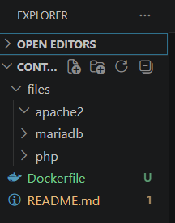

После этого был собран образ контейнера:

```bash
docker build -t apache2-php-mariadb .
```

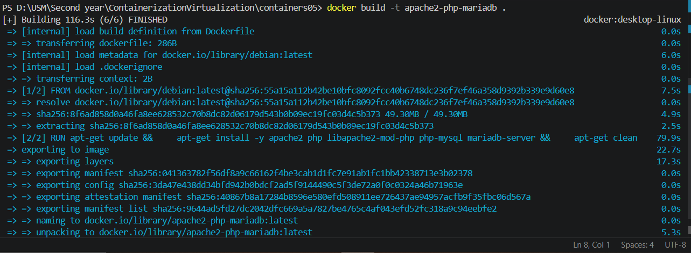

Далее был создан и запущен контейнер:

```bash
docker run --name apache2-php-mariadb -d apache2-php-mariadb
```

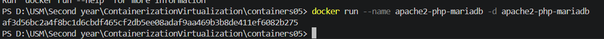

---

Затем из контейнера были скопированы конфигурационные файлы apache2, php и mariadb в локальную папку files:

```bash
docker cp apache2-php-mariadb:/etc/apache2/sites-available/000-default.conf files/apache2/
docker cp apache2-php-mariadb:/etc/apache2/apache2.conf files/apache2/
docker cp apache2-php-mariadb:/etc/php/8.4/apache2/php.ini files/php/
docker cp apache2-php-mariadb:/etc/mysql/mariadb.conf.d/50-server.cnf files/mariadb/
```

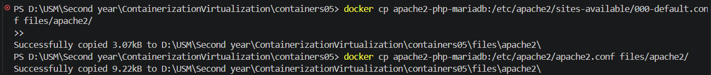
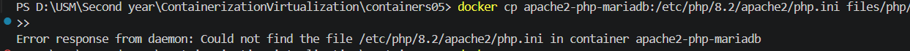
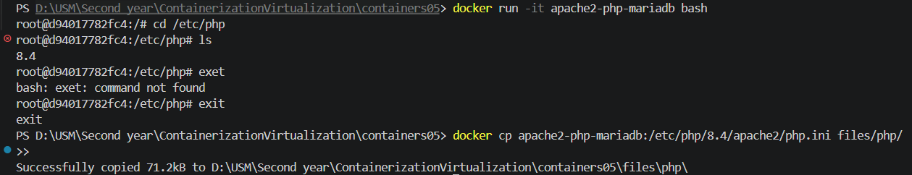

---

После этого были внесены изменения в конфигурационные файлы.

В apache2:

* добавлен ServerName localhost
  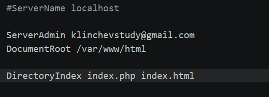
* изменён ServerAdmin
* добавлена строка DirectoryIndex index.php index.html

---

В php.ini были изменены параметры:

* error_log
* memory_limit
* upload_max_filesize
* post_max_size
* max_execution_time


---

В mariadb был включён лог ошибок:

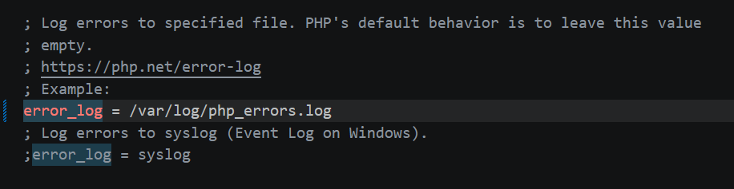

---

Далее был создан файл supervisord.conf для одновременного запуска apache2 и mariadb.

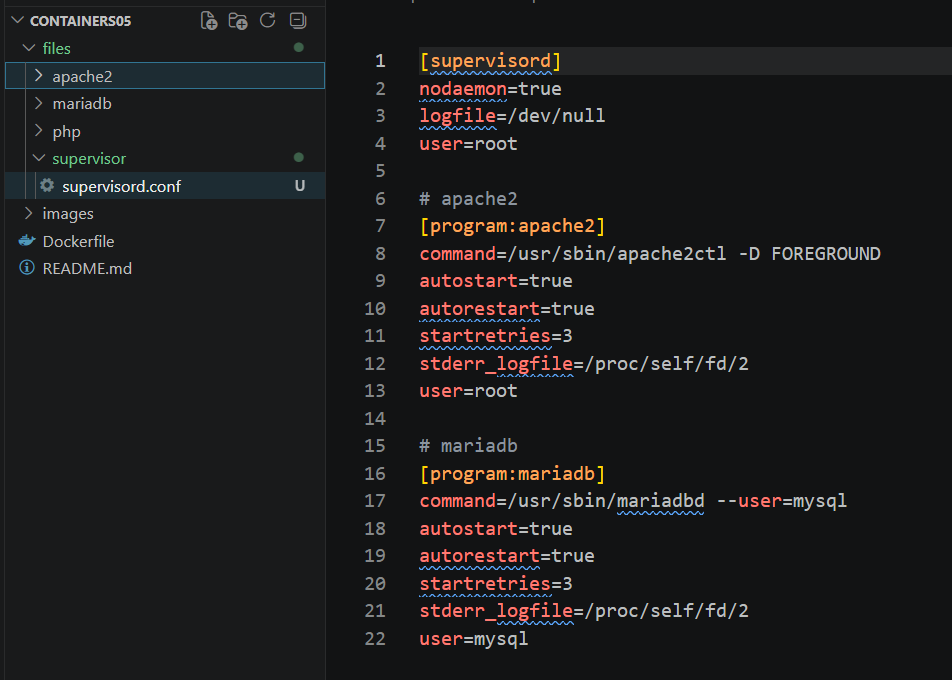

---

В Dockerfile был добавлен WordPress:

```dockerfile
ADD https://wordpress.org/latest.tar.gz /var/www/html/
```

После сборки оказалось, что сайт не работает и открывается стандартная страница Debian. Причина была в том, что архив WordPress не распаковывается автоматически.

Ошибка была исправлена путём отказа от слоя `ADD` в пользу:
```dockerfile
# download and unpack wordpress
RUN wget https://wordpress.org/latest.tar.gz -O /tmp/wordpress.tar.gz && \
    tar -xzf /tmp/wordpress.tar.gz -C /tmp && \
    rm -f /var/www/html/index.html && \
    cp -r /tmp/wordpress/* /var/www/html/ && \
    rm -rf /tmp/wordpress /tmp/wordpress.tar.gz
```

---

Далее внутри контейнера была создана база данных и пользователь:

```bash
mysql -u root
```

```sql
CREATE DATABASE wordpress;
CREATE USER 'wordpress'@'localhost' IDENTIFIED BY 'wordpress';
GRANT ALL PRIVILEGES ON wordpress.* TO 'wordpress'@'localhost';
FLUSH PRIVILEGES;
```

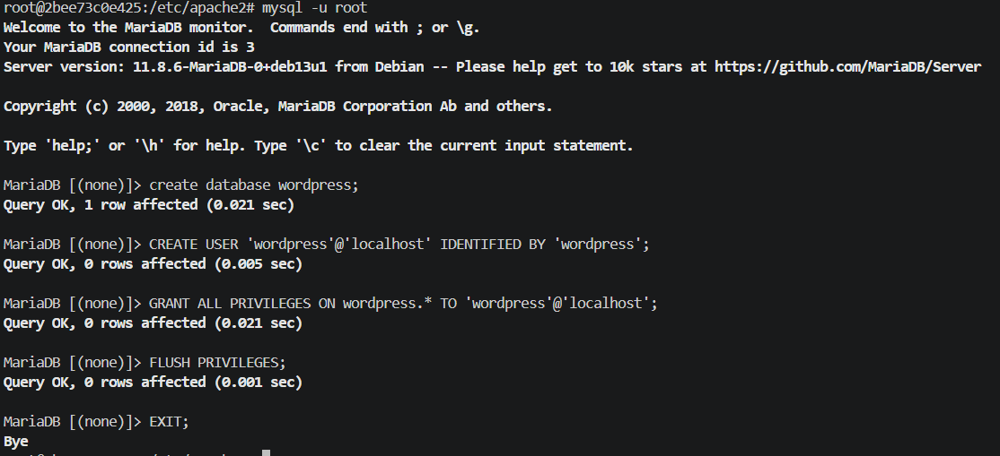

---

После этого был открыт сайт WordPress и введены параметры подключения к базе данных:

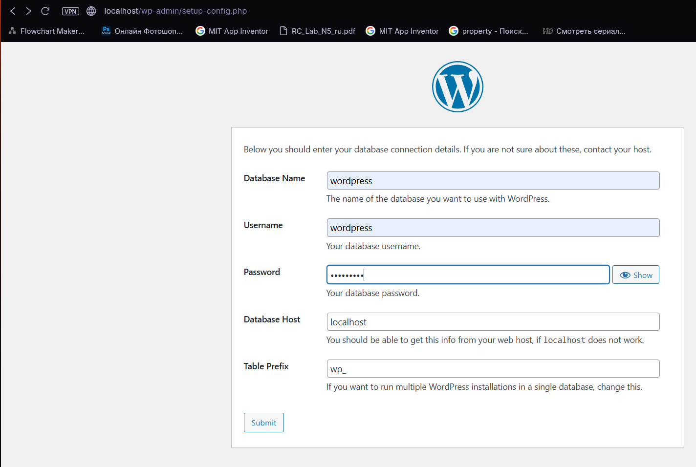

---

### Ответы на вопросы

**1. Какие файлы конфигурации были изменены?**
Были изменены файлы:

* apache2: 000-default.conf, apache2.conf
* php: php.ini
* mariadb: 50-server.cnf
* supervisor: supervisord.conf

---

**2. За что отвечает DirectoryIndex?**
Этот параметр указывает, какие файлы считаются главной страницей сайта.
В данном случае сначала будет открываться index.php, если его нет — index.html.

---

**3. Зачем нужен wp-config.php?**
Этот файл содержит настройки подключения WordPress к базе данных, а также другие основные параметры системы.

---

**4. За что отвечает post_max_size?**
Этот параметр задаёт максимальный размер данных, которые можно отправить через POST-запрос (например, загрузка файлов).

---

**5. Недостатки контейнера**

* все сервисы находятся в одном контейнере
* нет разделения на отдельные сервисы (web и database)

---

### Вывод

В ходе лабораторной работы был создан Docker-образ с Apache, PHP и MariaDB, настроены конфигурационные файлы и установлен WordPress.
Также была обнаружена и исправлена ошибка с нераспакованным архивом WordPress.
В результате сайт успешно запускается и подключается к базе данных.